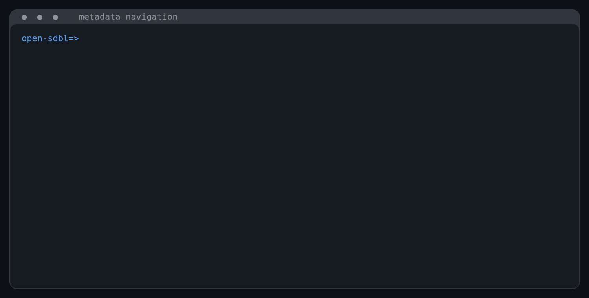
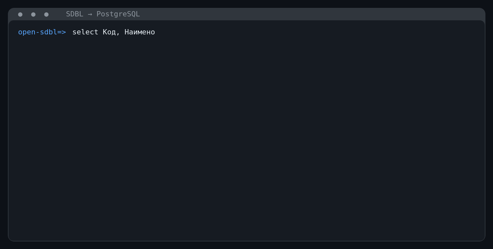
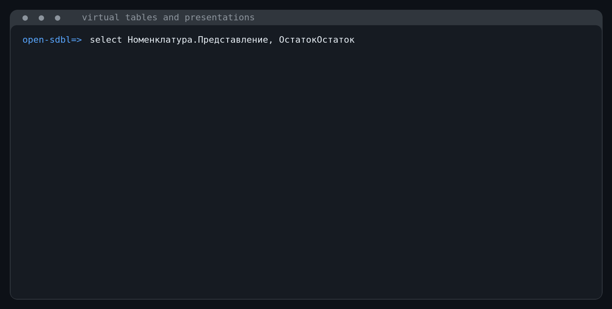

# open-sdbl

[](https://github.com/dobpilot/open-sdbl/actions/workflows/ci.yml)
[](https://doc.rust-lang.org/edition-guide/rust-2024/)
[](LICENSE)

`open-sdbl` — библиотека и интерактивная консоль для запросов к информационным
базам 1С на PostgreSQL и Microsoft SQL Server. Проект читает служебные
метаданные 1С, связывает имена объектов и реквизитов с физической схемой, а
затем преобразует запросы SDBL в SQL.

Ядро `open-sdbl` не выполняет I/O и не имеет production-зависимостей. Оно
декодирует переданные приложением `DBNames`, `Config` и `SchemaStorage`, строит
снимок метаданных и генерирует SQL в выбранном диалекте. Подключения к СУБД,
транзакции, интерактивный терминал и кеш находятся в отдельном приложении
`open-sdbl-cli`.

Сейчас поддерживаются SELECT-запросы, соединения и объединения, агрегаты,
разыменование ссылок, представления значений, а также виртуальные таблицы
регистров: срез первых/последних, остатки и обороты. Проект развивается и пока
не является полной заменой языка запросов платформы 1С.

## CLI в работе

Описание объекта показывает логическое имя, GUID, физическую таблицу,
реквизиты и индексы:



Перед исполнением консоль показывает сгенерированный SQL-запрос и
отдельно измеряет генерацию SQL и выполнение в СУБД:



Виртуальные таблицы и представления ссылок компилируются с учётом реальных
метаданных информационной базы:



## Начать использовать

Требуется Rust 1.85 или новее:

```console
git clone https://github.com/dobpilot/open-sdbl.git
cd open-sdbl
cargo build --release
```

Обычная release-сборка из корня создаёт CLI в
`target/release/open-sdbl`. Для сборки только библиотеки используйте
`cargo build --release --package open-sdbl`.

Поддерживаются два провайдера:

Провайдер | Порт | Драйвер | Источник пароля
--- | ---: | --- | ---
`postgres` | 5432 | `tokio-postgres` | `PGPASSWORD`, `PGPASSFILE`, `$HOME/.pgpass`
`mssql` | 1433 | Tiberius/TDS | `MSSQL_PASSWORD`

### PostgreSQL

```console
PGPASSFILE="$HOME/.pgpass" ./target/release/open-sdbl console postgres \
  --host db.example.local \
  --database onec \
  --user reader
```

Пароль читается из `PGPASSWORD`, `PGPASSFILE` или `$HOME/.pgpass`. Команда
работает через `tokio-postgres`, не требует установленного `psql` и выполняет
запросы в проверенной read-only транзакции `READ COMMITTED`.

### Microsoft SQL Server

Используйте SQL login с правами только на `SELECT`:

```console
MSSQL_PASSWORD='secret' ./target/release/open-sdbl console mssql \
  --host 192.168.122.222 \
  --database demo \
  --user open_sdbl_reader
```

CLI подключается через TDS, запрашивает `ApplicationIntent=ReadOnly` и
исполняет только фиксированные metadata-`SELECT` и `SELECT`, созданные
компилятором. SQL Server не имеет эквивалента PostgreSQL
`READ ONLY` для обычной транзакции, поэтому ограниченные права login —
обязательная граница безопасности.
Смещение дат 1С читается из `dbo._YearOffset`: консоль автоматически преобразует
физические MSSQL datetime-значения и литералы в логические даты 1С.
Системная колонка `_Version` (`timestamp`/`rowversion`) проецируется без
серверного `CAST`/`CONVERT`; CLI отображает полученные восемь байт как
`0x0123456789ABCDEF`.
Такое значение можно использовать как нативный бинарный литерал в фильтре:
`ГДЕ Version > 0x00000000000007D6`. После `0x` требуется ненулевое чётное
число шестнадцатеричных цифр.
Если расширение конфигурации 1С перенаправило строки объекта в таблицу с
суффиксом `X`/`X1`, MSSQL-компилятор автоматически объединяет её с канонической
таблицей. Это применяется к обычным источникам, разыменованию и функциям
`ПРЕДСТАВЛЕНИЕ()`/`ПРЕДСТАВЛЕНИЕССЫЛКИ()`.
Пользователю базы нужны `SELECT` на схему `dbo` и видимость определений
объектов для чтения `sys.tables`, `sys.columns` и `sys.indexes`; не
добавляйте его в
`db_datawriter` и не выдавайте `ALTER`, `CONTROL` или `EXECUTE`.

Сертификат TLS проверяется по умолчанию. Только для локального сервера с
самоподписанным сертификатом можно явно добавить
`--trust-server-certificate`; в production этот флаг использовать не следует.
Опциональную integration-проверку метаданных можно запустить так:

```console
OPEN_SDBL_MSSQL_TEST_USER=open_sdbl_reader MSSQL_PASSWORD='secret' \
  cargo test -p open-sdbl-cli reads_metadata_from_the_mssql_demo_database \
  -- --ignored
```

По умолчанию тест использует `192.168.122.222:1433/demo`; хост, порт и базу можно
переопределить через `OPEN_SDBL_MSSQL_TEST_HOST`,
`OPEN_SDBL_MSSQL_TEST_PORT` и `OPEN_SDBL_MSSQL_TEST_DATABASE`.

### Общие возможности CLI

При запуске в терминале загрузка метаданных показывает progress bar с фазой,
числом ресурсов Config и объёмом сжатых данных. Config читается потоково и
декодируется параллельно на blocking-пуле Tokio с ограниченным числом задач.
Progress выводится в `stderr`, поэтому табличный вывод `metadata` в
`stdout` можно по-прежнему безопасно перенаправлять или обрабатывать скриптом.

Если база доступна через SOCKS5-прокси (например, через `ssh -D`), добавьте
`--socks5-proxy 127.0.0.1:1080`. Прокси получает исходное имя из `--host` и
разрешает его на своей стороне. Сейчас поддерживается SOCKS5 без аутентификации;
пароль выбранного провайдера по-прежнему читается только из источников
выше.

Команда | Назначение
--- | ---
`\dt` | список таблиц и объектов метаданных
`\di` | список индексов
`\d <имя>` | реквизиты и индексы объекта
`\refresh` | перечитать метаданные
`\help` | справка
`\q` | выход

В консоли работают история по стрелкам, подсветка синтаксиса и Tab-дополнение
команд, ключевых слов, объектов, полей и виртуальных таблиц.

## Подключение `open-sdbl` к Rust-проекту

Пока crate не опубликован на crates.io, подключите Git-репозиторий или локальный
путь:

```toml
[dependencies]
open-sdbl = { git = "https://github.com/dobpilot/open-sdbl.git" }

# Для разработки рядом с репозиторием:
# open-sdbl = { path = "../open-sdbl" }
```

Приложение само получает бинарные ресурсы и каталоги СУБД, затем передаёт их в
ядро:

```rust
use open_sdbl::metadata::{
    LiveTable, MetadataError, MetadataSnapshot, parse_config_descriptors,
    parse_db_names, parse_schema_storage, resolve_metadata,
};

fn build_metadata(
    db_names_blob: &[u8],
    config_rows: &[(String, Vec<u8>)],
    schema_blob: &[u8],
    live_tables: Vec<LiveTable>,
) -> Result<MetadataSnapshot, MetadataError> {
    let db_names = parse_db_names(db_names_blob)?;
    let schema = parse_schema_storage(schema_blob)?;
    let mut descriptors = Vec::new();

    for (file_name, binary_data) in config_rows {
        descriptors.extend(parse_config_descriptors(file_name, binary_data)?);
    }

    Ok(resolve_metadata(
        db_names,
        descriptors,
        schema,
        live_tables,
    ))
}
```

Аргументы `build_metadata` читает ваше приложение; `config_rows` содержит
ресурсы с голым GUID в `FileName` и `PartNo = 0`. Готовые SELECT-only выражения
находятся в `PostgresMetadataQueries` и `MsSqlMetadataQueries`; ядро
намеренно не знает о сети, паролях и async runtime. Полные варианты загрузки через
`tokio-postgres` и Tiberius есть в
[`open-sdbl-cli`](crates/open-sdbl-cli/src/main.rs).

Для запроса без функций представления достаточно одного вызова:

```rust
use open_sdbl::{
    metadata::MetadataSnapshot,
    query::{CompiledQuery, QueryDiagnostic, compile_postgres_query},
};

fn compile(metadata: &MetadataSnapshot) -> Result<CompiledQuery, QueryDiagnostic> {
    let query = "ВЫБРАТЬ Код, Наименование ИЗ Справочник.Договоры";
    compile_postgres_query(query, metadata)
}
```

`CompiledQuery` содержит только SQL и имена выходных колонок. Исполнение SQL и
декодирование результата остаются ответственностью приложения.
Для MSSQL вызов отличается выбором компилятора и передачей смещения дат:

```rust
use open_sdbl::{
    metadata::MetadataSnapshot,
    query::{
        CompiledQuery, QueryDiagnostic, compile_mssql_query_with_year_offset,
    },
};

fn compile_mssql(
    metadata: &MetadataSnapshot,
    year_offset: i32,
) -> Result<CompiledQuery, QueryDiagnostic> {
    let query = "ВЫБРАТЬ ПЕРВЫЕ 10 Код, Наименование ИЗ Справочник.Договоры";
    compile_mssql_query_with_year_offset(query, metadata, year_offset)
}
```

`year_offset` — значение `dbo._YearOffset.Offset` (0 или 2000). CLI читает его
автоматически; при встраивании библиотеки это делает вызывающее приложение.

## Callback ABI представлений

Представление ссылки зависит от прикладной политики: одному приложению нужен
`Наименование (Код)`, другому — другой шаблон или язык. Поэтому
`.Представление`, `ПРЕДСТАВЛЕНИЕССЫЛКИ()` и `ПРЕДСТАВЛЕНИЕ()` компилируются в две
фазы:

```text
SDBL + MetadataSnapshot
        │
        ▼
prepare_postgres_query()
или prepare_mssql_query_with_year_offset()
        │
        ├── PresentationRequest { ObjectId/GUID возможных типов ссылок }
        │                                      │
        │                         callback приложения
        │                                      │
        ◄── PresentationPlan { FieldId[], структурированный шаблон }
        │
        ▼
PreparedPostgresQuery::compile()
или PreparedMsSqlQuery::compile()
        │
        ▼
CompiledQuery { sql, columns }
```

Контракт использует идентификаторы, а не имена:

Тип | Стабильное значение | Назначение
--- | --- | ---
`ObjectId` | 16 байт реального GUID 1С | возможный тип ссылочного значения
`AttributeId` | 16 байт реального GUID 1С | пользовательский реквизит
`StandardFieldId` | `#[repr(u32)]` | стандартное поле без GUID: код, наименование, номер, дата и другие
`FieldId` | `Metadata(AttributeId)` или `Standard(StandardFieldId)` | любое поле шаблона
`PresentationExpression` | `Field`, `Literal`, `Concat` | безопасное дерево выражения без сырого SQL

Lookup-методы `MetadataSnapshot::object_id()` и
`MetadataSnapshot::field_id()` преобразуют имя в ID при настройке политики.
Индексы снимка дают ожидаемый поиск O(1), не считая нормализации имени.

Пример callback-политики `Наименование (Код)`:

```rust
use open_sdbl::{
    metadata::{LookupError, MetadataSnapshot},
    query::{
        CompiledQuery, PresentationExpression, PresentationPlan,
        prepare_postgres_query,
    },
};

fn compile_with_presentations(
    source: &str,
    metadata: &MetadataSnapshot,
) -> Result<CompiledQuery, Box<dyn std::error::Error>> {
    let prepared = prepare_postgres_query(source, metadata)?;

    // Это callback приложения. Запрос содержит дедуплицированный набор GUID
    // всех возможных типов ссылок, найденных ядром в SDBL.
    let plans = prepared
        .presentation_request()
        .targets
        .iter()
        .map(|target| -> Result<PresentationPlan, LookupError> {
            let name = metadata.field_id(target.object, "Наименование")?;
            let code = metadata.field_id(target.object, "Код")?;

            Ok(PresentationPlan {
                object: target.object,
                fields: vec![name, code],
                expression: PresentationExpression::Concat(vec![
                    PresentationExpression::Field(name),
                    PresentationExpression::Literal(" (".into()),
                    PresentationExpression::Field(code),
                    PresentationExpression::Literal(")".into()),
                ]),
            })
        })
        .collect::<Result<Vec<_>, _>>()?;

    Ok(prepared.compile(metadata, &plans)?)
}
```

Для MSSQL используются те же `PresentationRequest`, `PresentationPlan` и
callback-политика. На первой фазе вызовите
`prepare_mssql_query_with_year_offset()`, передав значение `_YearOffset`.

Ядро проверяет, что на каждый запрошенный `ObjectId` получен ровно один план,
все `FieldId` действительно принадлежат объекту, а шаблон использует только
разрешённые поля. После проверки оно добавляет необходимые `LEFT JOIN`, `CASE`
и SQL-выражение представления. Callback вызывается во время компиляции сразу
для пакета типов, а не для каждой строки результата, поэтому приложение может
кешировать планы по GUID и поколению метаданных. CLI использует для этого
ограниченный кеш Moka.

> [!NOTE]
> Здесь ABI означает типизированный контракт между ядром и приложением. Сейчас
> это публичный Rust API; стабильного `extern "C"` ABI для подключения из других
> языков в проекте пока нет. `ObjectId::as_bytes()` и `AttributeId::as_bytes()`
> позволяют построить такой адаптер без передачи строковых имён.

## Лицензия

[GNU General Public License v3.0 only](LICENSE).
