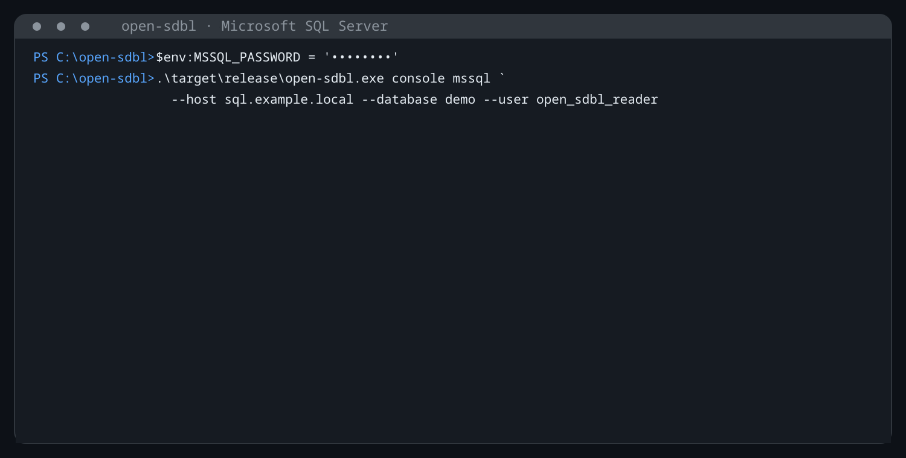

# open-sdbl

[](https://github.com/dobpilot/open-sdbl/actions/workflows/ci.yml)
[](https://doc.rust-lang.org/edition-guide/rust-2024/)
[](LICENSE)

`open-sdbl` — библиотека и интерактивная консоль для запросов к информационным
базам 1С на PostgreSQL и Microsoft SQL Server. Проект читает служебные
метаданные 1С, связывает имена объектов и реквизитов с физической схемой, а
затем преобразует запросы SDBL в SQL.

Ядро `open-sdbl` не выполняет I/O и не имеет production-зависимостей. Оно
декодирует переданные приложением `DBNames`, `Config` и `SchemaStorage`, строит
снимок метаданных и генерирует SQL в выбранном диалекте. Подключения к СУБД,
транзакции, интерактивный терминал и кеш находятся в отдельном приложении
`open-sdbl-cli`.

Поддерживаются обе раскладки служебных таблиц платформы. В базах 8.2 и ранних
8.3 (до формата 8.3.8) `Params`/`Config` не имеют колонки `PartNo`, а таблиц
`ConfigCAS` и `_ExtensionsRestruct` нет; в современных базах крупные ресурсы
разбиты на части с номерами от нуля. Консоль определяет раскладку одним
каталожным запросом (`StorageLayout`), выбирает подходящие SELECT-выражения,
собирает части ресурса перед распаковкой и пропускает чтение расширений, если их
таблиц нет. База без `SchemaStorage` отклоняется типизированной ошибкой:
без неё физическую схему восстановить нельзя.

Сейчас поддерживаются SELECT-запросы, соединения и объединения, агрегаты,
разыменование ссылок, представления значений, пакеты с временными таблицами,
а также виртуальные таблицы регистров: срез первых/последних, остатки и
обороты. Проект развивается и пока
не является полной заменой языка запросов платформы 1С.

Имена результирующих колонок можно задавать через `КАК`/`AS`. Табличные части
документов и справочников доступны по полному имени
`Тип.Объект.ТабличнаяЧасть`; стандартные поля строки называются `Ссылка` и
`НомерСтроки`. Например:

```sql
ВЫБРАТЬ
    строки.Ссылка.ДоговорКонтрагента КАК Договор,
    строки.Сумма КАК СуммаСНДС
ИЗ
    Документ.ДополнительныеУсловияПоДоговору.ГрафикНачислений КАК строки;
```

Физическое имя табличной части разрешается через Config, DBNames и
SchemaStorage. Если данные конфигурации находятся только в таблице расширения
с суффиксом `X`/`X1`, компилятор использует её; при нескольких точных вариантах
они читаются как одна детерминированная `UNION ALL` relation.

Ядро также объединяет переданные вызывающим кодом метаданные
расширений через `resolve_metadata_with_extensions`. Реквизиты,
добавленные расширением, доступны в проекции, фильтрах,
сортировке и разыменовании ссылок; discovery сохраняет имя
расширения. `parse_extension_restructure` декодирует ресурс
`_ExtensionsRestruct._restructData` (авторитетный маппинг
`GUID → Fld<N> → тип → имя реквизита`), а
`extension_metadata_from_restructure` превращает его в
`ExtensionMetadata`, поэтому реквизит, физически живущий только в
таблице `X1`, становится queryable под своим именем. CLI SELECT-only
читает `ConfigCAS` и `_ExtensionsRestruct`. Разбор внутреннего
content-addressed графа `ConfigCAS` остаётся caller-provided.

Служебные таблицы платформы из `SchemaStorage` проецируются как
типизированные метаданные. PostgreSQL и MSSQL поддерживают новые
источники на обоих языках:

```sql
SELECT Node, MessageNo
FROM AccumulationRegister.RegisteredTotals.Changes;

SELECT LineNo
FROM ChartOfCalculationTypes.Payroll.LeadingCalculationKinds;

SELECT DimKind
FROM ChartOfAccounts.MainAccounts.ExtraDimensions;
```

Русские имена табличных частей: `Изменения`, `БазовыеВидыРасчета`,
`ВедущиеВидыРасчета`, `ВытесняющиеВидыРасчета` и `ВидыСубконто`.
Остальные распознанные platform stores видны в `\dt`/`\d`, но прямое
использование resolve-only объекта в `FROM` возвращает типизированную
диагностику unsupported feature.

В `ПО`/`ON` соединения требуется хотя бы одно равенство прямых полей разных
источников. К нему через `И`/`AND` можно добавлять скалярные фильтры по прямым
полям, включая сравнения, `В`/`IN`, `ЗНАЧЕНИЕ`/`VALUE`, проверки NULL и функции
дат. Эти фильтры остаются в `ON`, поэтому семантика внешних соединений не
меняется. Разыменование ссылок внутри `ON` пока не поддерживается.

Конструктор даты и начало периода поддерживаются на русском и английском:

```sql
ВЫБРАТЬ
    ДАТАВРЕМЯ(2026, 9, 2, 12, 30, 0) КАК Момент,
    НАЧАЛОПЕРИОДА(Документ.Дата, МЕСЯЦ) КАК НачалоМесяца
ИЗ
    Документ.РеализацияТоваровУслуг КАК Документ;
```

`ДАТАВРЕМЯ`/`DATETIME` принимает от трёх до шести целочисленных компонентов;
пропущенное время равно `00:00:00`. Для
`НАЧАЛОПЕРИОДА`/`BEGINOFPERIOD` доступны `МИНУТА`, `ЧАС`, `ДЕНЬ`, `НЕДЕЛЯ`,
`ДЕКАДА`, `МЕСЯЦ`, `КВАРТАЛ`, `ПОЛУГОДИЕ`, `ГОД` и английские эквиваленты.
Неделя начинается в понедельник: региональная настройка первого дня недели
пока не входит в `MetadataSnapshot`.

Метаданные перечислений и предопределённых элементов справочников доступны
через `ЗНАЧЕНИЕ`/`VALUE`:

```sql
ВЫБРАТЬ
    ЗНАЧЕНИЕ(Перечисление.бит_ВидыСтатусовОбъектов.Статус),
    ЗНАЧЕНИЕ(Справочник.бит_СтатусыОбъектов.Утвержден),
    ЗНАЧЕНИЕ(Справочник.бит_СтатусыОбъектов.ДополнительныеУсловияПоДоговору_Проверен);
```

Имена разрешаются строго по Config, включая ресурсы `<guid>.1c`. Для
предопределённого элемента справочника SQL получает ссылку по стабильному
`_PredefinedID`; отображаемые наименования и коды для поиска не используются.

Функция `УНИКАЛЬНЫЙИДЕНТИФИКАТОР`/`UUID` возвращает ссылку в виде нативного
`uuid` (PostgreSQL) или `uniqueidentifier` (MSSQL) в том же виде, что
`УникальныйИдентификатор(Ссылка)` в 1С. Перестановка байт выполняется чистым
SQL без серверных расширений; `NULL` остаётся `NULL`:

```sql
ВЫБРАТЬ
    УНИКАЛЬНЫЙИДЕНТИФИКАТОР(Ссылка) КАК Идентификатор,
    UUID(Организация) AS Owner
ИЗ Справочник.Контрагенты
ГДЕ УНИКАЛЬНЫЙИДЕНТИФИКАТОР(Ссылка) = "d2f8bde9-fadd-4be8-9022-249e3a1ac4b9";
```

Аргументом может быть ссылка источника, ссылочный реквизит, разыменованная
ссылка (`Организация.Ссылка`) или составное поле — тогда декодируется его
часть `_RRRef`. Нессылочное поле, литерал, `ЗНАЧЕНИЕ` и запрос без `ИЗ`
отклоняются диагностикой.

`ВЫРАЗИТЬ`/`CAST` поддерживает скалярные цели `СТРОКА(n)`, `ЧИСЛО(p, s)`,
`БУЛЕВО`, `ДАТА` (на PostgreSQL — `substring(… from 1 for n)`, `::numeric(p, s)`,
`::boolean`, `::timestamp`; на MSSQL — `CONVERT(nvarchar(n) | numeric(p, s) |
bit | datetime2, …)`) и сужение ссылки до конкретного объекта с одним
разыменованием:

```sql
ВЫБРАТЬ
    ВЫРАЗИТЬ(Реквизиты.Комментарий КАК СТРОКА(500)) КАК Комментарий,
    ВЫРАЗИТЬ(Реквизиты.Документ КАК Документ.ЗаказПокупателя).Дата КАК ДатаЗаказа,
    ВЫРАЗИТЬ(Реквизиты.Документ КАК Документ.ЗаказПокупателя) КАК Заказ
ИЗ РегистрСведений.ДанныеДокументов КАК Реквизиты;
```

Сужение составного или универсального поля даёт `RRRef`, если `RTRef`
совпадает с типом (иначе `NULL`); `.Поле` после сужения компилируется в
`LEFT JOIN` целевой таблицы с guard по `RTRef` и переиспользует уже
созданные соединения. Поле с единственной фиксированной целью сужается
только к ней. Тип результата отражается в `ColumnKind`.

Булевы поля, `ИСТИНА`/`ЛОЖЬ` и `ВЫРАЗИТЬ(… КАК БУЛЕВО)` в условиях `ГДЕ`/`ПО`
на MSSQL компилируются в сравнение `= 0x01` (в `bit` нет булевых выражений);
на PostgreSQL остаётся прямая форма.

`ВЫБОР … КОНЕЦ`, `ЕСТЬNULL` и `ПОДОБНО` компилируются в `CASE`, `COALESCE`
и `LIKE`; агрегаты принимают любое скалярное выражение:

```sql
ВЫБРАТЬ
    ВЫБОР КОГДА Проведен ТОГДА "Проведён" ИНАЧЕ "Черновик" КОНЕЦ КАК Состояние,
    СУММА(ВЫБОР КОГДА Товары.Количество > 0 ТОГДА Товары.Сумма ИНАЧЕ 0 КОНЕЦ) КАК Продажи,
    ЕСТЬNULL(Комментарий, "") КАК Комментарий
ИЗ Документ.Реализация КАК Товары
ГДЕ Номер ПОДОБНО "[0-9]%" И Номер НЕ ПОДОБНО "%\_%" СПЕЦСИМВОЛ "\";
```

Вид результата `ВЫБОР`/`ЕСТЬNULL` — вид первой не-`NULL` ветви; остальные ветви
должны быть совместимы по варианту `ColumnKind`. Ссылочные ветви на разные
объекты (и ветви `ОБЪЕДИНИТЬ`) расширяются до одной runtime-typed колонки
`RTRef ‖ RRRef` с объединением целей. Шаблон `ПОДОБНО` передаётся в `LIKE`
без переписывания: на MSSQL классы `[…]`/`[^…]` поддерживает сам `LIKE`, на
PostgreSQL — расширение `mchar`; оператор допустим только в условиях, а его
операнды должны быть строковыми. Условие `КОГДА` — предикат, поэтому булевы
поля на MSSQL сравниваются с `0x01`; `ВЫБОР` булевого вида в `ГДЕ`
оборачивается в `(… = 0x01)`.

Ветвь может содержать цепочку соединений: каждое `ПО` обязано связать
присоединяемый источник равенством с любым более ранним источником,
остальные скалярные условия через `И` остаются в `ON`; обращение к
источнику, присоединяемому позже, отклоняется диагностикой. В равенстве
допустимы прямые поля и одношаговые разыменования (`К.Ссылка.Основание =
Док.Ссылка`); когда условие разыменовывает ссылку, соединения
разыменования выводятся группой рядом со своим источником, чтобы `ON`
мог на них ссылаться. Ссылки разной ширины приводятся к одному виду:
фиксированная получает номер типа своей цели, составная конкатенируется,
колонка подзапроса или временной таблицы сравнивается как есть.
`ПОЛНОЕ СОЕДИНЕНИЕ` допустимо только единственным в ветви и требует в `ПО`
прямых полей. Один и тот же
объект можно присоединять несколько раз под разными псевдонимами, а
разыменование работает через любой источник цепочки:

```sql
ВЫБРАТЬ Док.Номер, Строки.НомерСтроки, ЦФО.Наименование, Строки.ЦФО.Родитель.Код
ИЗ Документ.Реализация КАК Док
ВНУТРЕННЕЕ СОЕДИНЕНИЕ Документ.Реализация.Товары КАК Строки ПО Строки.Ссылка = Док.Ссылка
ЛЕВОЕ СОЕДИНЕНИЕ Справочник.ЦФО КАК ЦФО ПО ЦФО.Ссылка = Строки.ЦФО И Док.Проведен;
```

Вложенные запросы поддерживаются как источник (`ИЗ (ВЫБРАТЬ …) КАК Т`,
в том числе в соединениях) и как операнд `[НЕ] В (ВЫБРАТЬ …)`. Колонки
подзапроса становятся полями источника со своими `ColumnKind`; ссылочная
колонка с одной фиксированной целью разыменовывается (`Т.Ссылка.Наименование`),
runtime-typed колонка представляется отложенно во внешнем запросе. Внутри
подзапроса допустимы объединения, группировка, соединения, `ПЕРВЫЕ`,
`РАЗЛИЧНЫЕ` и `УПОРЯДОЧИТЬ ПО` вместе с `ПЕРВЫЕ`; запрещены `*`, отложенные
представления и ссылки на внешние источники (коррелированные подзапросы).
Подзапрос в `В (…)` проецирует ровно одну колонку совместимого вида; ссылки
разной ширины приводятся к `RTRef ‖ RRRef`. Глубина вложенности ограничена
шестнадцатью уровнями. Колонка, названная в подзапросе стандартным именем
`Ссылка`, приходит во внешний запрос с меткой `ID`, поэтому в примерах ниже
ей задан явный псевдоним.

```sql
ВЫБРАТЬ Т.Номенклатура, Т.Итог, Н.Наименование
ИЗ (ВЫБРАТЬ Товары.Номенклатура КАК Номенклатура, СУММА(Товары.Сумма) КАК Итог
    ИЗ Документ.Реализация.Товары КАК Товары
    СГРУППИРОВАТЬ ПО Товары.Номенклатура) КАК Т
ЛЕВОЕ СОЕДИНЕНИЕ Справочник.Номенклатура КАК Н ПО Н.Ссылка = Т.Номенклатура
ГДЕ Т.Номенклатура НЕ В (ВЫБРАТЬ Ссылка ИЗ Справочник.Номенклатура ГДЕ ПометкаУдаления);
```

Текст запроса может быть пакетом операторов, разделённых `;`: `ПОМЕСТИТЬ`
создаёт временную таблицу, `ДОБАВИТЬ` дописывает в неё строки, `УНИЧТОЖИТЬ`
удаляет её, а следующие операторы читают таблицу по имени. Подробности — в
разделе «Временные таблицы».

Составное ссылочное поле (`ЛюбаяСсылка`, `Регистратор`, колонка подзапроса
или временной таблицы) тоже разыменовывается. Цели берутся из SchemaStorage,
из вида колонки подзапроса или перебором ссылочных объектов, у которых есть
реквизит с таким именем, как это делает платформа. Каждая цель получает
`LEFT JOIN` с охраной по типу, а значение собирается `ВЫБОР`-ом по `_RTRef`,
поэтому строки других типов дают `NULL`:

```sql
ВЫБРАТЬ Связь.СвязанныйОбъект.РегистрационныйНомер КАК Номер
ИЗ РегистрСведений.СвязиОбъектов КАК Связь
```

Виды реквизита в разных целях обязаны совпадать по варианту; строки берут
максимальную длину, ссылки расширяются до `RTRef ‖ RRRef`. Больше 32 целей,
представление такого значения и второй шаг разыменования отклоняются
диагностикой с советом сузить тип через `ВЫРАЗИТЬ`.

`СГРУППИРОВАТЬ ПО`/`GROUP BY` и `ИМЕЮЩИЕ`/`HAVING` компилируются напрямую.
Ключом может быть путь поля (включая одно разыменование), псевдоним проекции
или выражение, совпадающее с проекцией; каждая неагрегатная проекция обязана
быть ключом (правило 1С), иначе диагностика. Ссылочный ключ группируется по
всем физическим членам (`_RTRef`, `_RRRef`), представления ключей добавляют
свои колонки в `GROUP BY`. Агрегаты допустимы в проекциях сгруппированной
ветви (в том числе внутри `ВЫБОР`) и в `ИМЕЮЩИЕ`, но не в `ГДЕ` и `ПО`;
сортировка сгруппированной ветви — по ключам и псевдонимам проекций.
`ПОЛНОЕ СОЕДИНЕНИЕ` с группировкой пока не поддерживается.

```sql
ВЫБРАТЬ
    Товары.Номенклатура КАК Номенклатура,
    НАЧАЛОПЕРИОДА(Товары.Ссылка.Дата, МЕСЯЦ) КАК Месяц,
    СУММА(Товары.Сумма) КАК Сумма,
    КОЛИЧЕСТВО(РАЗЛИЧНЫЕ Товары.Ссылка) КАК Документов
ИЗ Документ.Реализация.Товары КАК Товары
СГРУППИРОВАТЬ ПО Товары.Номенклатура, Месяц
ИМЕЮЩИЕ СУММА(Товары.Сумма) > 1000
УПОРЯДОЧИТЬ ПО Сумма УБЫВ;
```

Оператор `В`/`IN` принимает непустой список скалярных выражений, в том числе
несколько метаданных значений:

```sql
ВЫБРАТЬ Ссылка, Наименование
ИЗ Справочник.бит_СтатусыОбъектов
ГДЕ Ссылка В (
    ЗНАЧЕНИЕ(Справочник.бит_СтатусыОбъектов.Утвержден),
    ЗНАЧЕНИЕ(Справочник.бит_СтатусыОбъектов.ДополнительныеУсловияПоДоговору_Проверен)
);
```

## CLI в работе

Описание объекта показывает логическое имя, GUID, физическую таблицу,
реквизиты и индексы:


Перед исполнением консоль показывает сгенерированный SQL-запрос и
отдельно измеряет генерацию SQL и выполнение в СУБД:


Виртуальные таблицы и представления ссылок компилируются с учётом реальных
метаданных информационной базы:


При работе с Microsoft SQL Server консоль генерирует T-SQL, читает данные из
таблиц расширений конфигурации и показывает время выполнения на MSSQL:



## Начать использовать

Требуется Rust 1.85 или новее:

```console
git clone https://github.com/dobpilot/open-sdbl.git
cd open-sdbl
cargo build --release
```

Обычная release-сборка из корня создаёт CLI в
`target/release/open-sdbl`. Для сборки только библиотеки используйте
`cargo build --release --package open-sdbl`.

Поддерживаются два провайдера:

Провайдер | Порт | Драйвер | Источник пароля
--- | ---: | --- | ---
`postgres` | 5432 | `tokio-postgres` | `PGPASSWORD`, `PGPASSFILE`, `$HOME/.pgpass`
`mssql` | 1433 | Tiberius/TDS | `MSSQL_PASSWORD`

### PostgreSQL

```console
PGPASSFILE="$HOME/.pgpass" ./target/release/open-sdbl console postgres \
  --host db.example.local \
  --database onec \
  --user reader
```

Из PowerShell:

```powershell
$securePassword = Read-Host "PostgreSQL password" -AsSecureString
$env:PGPASSWORD = [System.Net.NetworkCredential]::new("", $securePassword).Password

try {
    .\target\release\open-sdbl.exe console postgres `
        --host db.example.local `
        --database onec `
        --user reader
}
finally {
    Remove-Item Env:PGPASSWORD
}
```

Пароль читается из `PGPASSWORD`, `PGPASSFILE` или `$HOME/.pgpass`. Команда
работает через `tokio-postgres`, не требует установленного `psql` и выполняет
запросы в проверенной read-only транзакции `READ COMMITTED`.

TLS включён по умолчанию в режиме `verify-full`: проверяются цепочка
сертификата и имя сервера. Доступны `--sslmode require`, `verify-ca` и
`verify-full`; значение `PGSSLMODE` используется, только если флаг не задан.
Для корпоративного или собственного CA укажите
`--trust-ca-file company-ca.pem` вместе с `verify-ca` или `verify-full`;
в этом случае доверие ограничивается сертификатами из указанного файла.
Отключение TLS возможно лишь явной парой
`--sslmode disable --insecure-plaintext` и не рекомендуется вне изолированной
сети разработки.

### Microsoft SQL Server

Используйте отдельный SQL login, включённый в `db_datareader`, но не в
`db_datawriter`, `db_owner` или серверную роль `sysadmin`:

```console
MSSQL_PASSWORD='secret' ./target/release/open-sdbl console mssql \
  --host 192.168.122.222 \
  --database demo \
  --user open_sdbl_reader
```

Из PowerShell:

```powershell
$securePassword = Read-Host "MSSQL password" -AsSecureString
$env:MSSQL_PASSWORD = [System.Net.NetworkCredential]::new("", $securePassword).Password

try {
    .\target\release\open-sdbl.exe console mssql `
        --host sql.example.local `
        --database demo `
        --user open_sdbl_reader
}
finally {
    Remove-Item Env:MSSQL_PASSWORD
}
```

Для тестового сервера с самоподписанным сертификатом к команде можно добавить
`--trust-server-certificate`; этот флаг отключает проверку сертификата и не
подходит для production.
Предпочтительный вариант для частного CA — `--trust-ca-file company-ca.pem`:
шифрование и проверка сертификата при этом сохраняются.

CLI подключается через TDS, запрашивает `ApplicationIntent=ReadOnly` и
исполняет только фиксированные metadata-`SELECT` и `SELECT`, созданные
компилятором. SQL Server не имеет эквивалента PostgreSQL
`READ ONLY` для обычной транзакции, поэтому ограниченные права login —
обязательная граница безопасности. Перед каждым чтением CLI проверяет на
сервере `@@TRANCOUNT`, уровень изоляции и членство в read-only ролях; сессия с
незавершённой транзакцией или write-capable ролью отвергается.
Уровень диалекта T-SQL консоль определяет по `SERVERPROPERTY('ProductVersion')`:
SQL Server 2008/2008 R2 получают уровень `2008` (без функций 2012 года,
`НАЧАЛОПЕРИОДА` через `DATEADD`/`DATEDIFF`), 2012 и новее — `2012`. Выбранный
уровень печатается при старте консоли (`MSSQL dialect: 2008 (server
10.50.6000.34)`), а флаг `--mssql-dialect 2008|2012` переопределяет детекцию.
Поддерживаются SQL Server 2008 R2 и новее, PostgreSQL 9.0 и новее (для
серверов до 9.4 запрос каталога выполняется без `LATERAL`).

Смещение дат 1С читается из `dbo._YearOffset`: консоль автоматически преобразует
физические MSSQL datetime-значения и литералы в логические даты 1С.
Системная колонка `_Version` (`timestamp`/`rowversion`) проецируется без
серверного `CAST`/`CONVERT`; CLI отображает полученные восемь байт как
`0x0123456789ABCDEF`.
Такое значение можно использовать как нативный бинарный литерал в фильтре:
`ГДЕ Version > 0x00000000000007D6`. После `0x` требуется ненулевое чётное
число шестнадцатеричных цифр.
Если расширение конфигурации 1С перенаправило строки объекта в таблицу с
суффиксом `X`/`X1`, MSSQL-компилятор автоматически объединяет её с канонической
таблицей. Это применяется к обычным источникам, разыменованию и функциям
`ПРЕДСТАВЛЕНИЕ()`/`ПРЕДСТАВЛЕНИЕССЫЛКИ()`.
Пользователю базы нужны `SELECT` на схему `dbo` и видимость определений
объектов для чтения `sys.tables`, `sys.columns` и `sys.indexes`; не
добавляйте его в
`db_datawriter` и не выдавайте `ALTER`, `CONTROL` или `EXECUTE`.

Сертификат TLS проверяется по умолчанию.
Опциональную integration-проверку метаданных можно запустить так:

```console
OPEN_SDBL_MSSQL_TEST_USER=open_sdbl_reader MSSQL_PASSWORD='secret' \
  cargo test -p open-sdbl-cli reads_metadata_from_the_mssql_demo_database \
  -- --ignored
```

По умолчанию тест использует `192.168.122.222:1433/demo`; хост, порт и базу можно
переопределить через `OPEN_SDBL_MSSQL_TEST_HOST`,
`OPEN_SDBL_MSSQL_TEST_PORT` и `OPEN_SDBL_MSSQL_TEST_DATABASE`.

### Секреты и SOCKS5

Пароли не принимаются аргументами командной строки. При старте CLI забирает
`PGPASSWORD`, `MSSQL_PASSWORD` и `SOCKS5_PASSWORD` в очищаемую память и удаляет
переменные из окружения процесса. Файл `.pgpass` читается через один открытый
дескриптор; на Unix он должен быть обычным файлом текущего пользователя с
правами `0600` или строже.

Оба провайдера поддерживают `--socks5-proxy HOST:PORT`. Для прокси с
username/password укажите `--socks5-user USER`, а пароль передайте только через
`SOCKS5_PASSWORD`. Безопасность соединения с базой по-прежнему определяется
TLS-режимом провайдера: SOCKS5 сам по себе не заменяет TLS.

### Общие возможности CLI

При запуске в терминале загрузка метаданных показывает progress bar с фазой,
числом ресурсов Config и объёмом сжатых данных. Config читается потоково и
декодируется параллельно на blocking-пуле Tokio с ограниченным числом задач.
Progress выводится в `stderr`, поэтому табличный вывод `metadata` в
`stdout` можно по-прежнему безопасно перенаправлять или обрабатывать скриптом.

Если база доступна через SOCKS5-прокси (например, через `ssh -D`), добавьте
`--socks5-proxy 127.0.0.1:1080`. Прокси получает исходное имя из `--host` и
разрешает его на своей стороне. Сейчас поддерживается SOCKS5 без аутентификации;
пароль выбранного провайдера по-прежнему читается только из источников
выше.

Команда | Назначение
--- | ---
`\dt` | список таблиц и объектов метаданных
`\di` | список индексов
`\d <имя>` | реквизиты и индексы объекта
`\refresh` | перечитать метаданные
`\set <имя> <литерал>` | сохранить параметр запроса `&имя` (число, строка, `ИСТИНА`/`ЛОЖЬ`, `NULL`, `ДАТАВРЕМЯ(…)`, `0x…`, `ЗНАЧЕНИЕ(Перечисление.X.Y)`, `ЗНАЧЕНИЕ(….ПустаяСсылка)` или список в скобках)
`\params` | список сохранённых параметров: имя, литерал как введён, вид
`\unset <имя>` | удалить параметр
`\tables` | список временных таблиц сессии: имя и колонки с видами
`\help` | справка
`\q` | выход

В консоли работают история по стрелкам, подсветка синтаксиса и Tab-дополнение
команд, ключевых слов, объектов, полей, виртуальных и временных таблиц.

Временные таблицы живут в сессии консоли: оператор с `ПОМЕСТИТЬ` или
`ДОБАВИТЬ` показывает строку `Количество`, `УНИЧТОЖИТЬ` печатает список
удалённых таблиц и ничего не выполняет, `\tables` показывает доступные
таблицы, а `\refresh` забывает их вместе с метаданными. Пакет из
конфигуратора можно вставлять целиком: консоль выполняет операторы по одному
и приходит к тому же результату.

Значения читаются из СУБД в нативных типах и форматируются самой консолью по
одним правилам для PostgreSQL и MSSQL: бинарные данные и ссылки — `0x` и
шестнадцатеричные цифры в верхнем регистре, булевы — `true`/`false`, даты —
`YYYY-MM-DD HH:MM:SS` без дробных секунд, числа — с объявленным масштабом
(`15.50`), UUID — канонически в нижнем регистре, отсутствующее значение —
`NULL`. Для PostgreSQL декодеры `numeric`, `timestamp`, `date` и `uuid`
реализованы в самой консоли без дополнительных зависимостей; колонка
неподдерживаемого типа приводит к ошибке данных с именем типа, а не к печати
мусора.

## Подключение `open-sdbl` к Rust-проекту

Пока crate не опубликован на crates.io, подключите Git-репозиторий или локальный
путь:

```toml
[dependencies]
open-sdbl = { git = "https://github.com/dobpilot/open-sdbl.git" }

# Для разработки рядом с репозиторием:
# open-sdbl = { path = "../open-sdbl" }
```

Приложение само получает бинарные ресурсы и каталоги СУБД, затем передаёт их в
ядро:

```rust
use open_sdbl::metadata::{
    LiveTable, MetadataError, ResolvedMetadata, parse_config_descriptors,
    parse_db_names, parse_schema_storage, resolve_metadata,
};

fn build_metadata(
    db_names_blob: &[u8],
    config_rows: &[(String, Vec<u8>)],
    schema_blob: &[u8],
    live_tables: Vec<LiveTable>,
) -> Result<ResolvedMetadata, MetadataError> {
    let db_names = parse_db_names(db_names_blob)?;
    let schema = parse_schema_storage(schema_blob)?;
    let mut descriptors = Vec::new();

    for (file_name, binary_data) in config_rows {
        descriptors.extend(parse_config_descriptors(file_name, binary_data)?);
    }

    Ok(resolve_metadata(
        db_names,
        descriptors,
        schema,
        live_tables,
    ))
}
```

Аргументы `build_metadata` читает ваше приложение; `config_rows` содержит
ресурсы с голым GUID в `FileName`, собранные из всех частей `PartNo` (или
единственную строку в legacy-базе). Готовые SELECT-only выражения находятся в
`PostgresMetadataQueries` и `MsSqlMetadataQueries`: сначала выполните `LAYOUT`,
постройте `StorageLayout::from_flags`, затем берите выражения через
`db_names(&layout)`, `config(&layout)`, `extension_resources(&layout)`; ядро
намеренно не знает о сети, паролях и async runtime. Полные варианты загрузки через
`tokio-postgres` и Tiberius есть в
[`open-sdbl-cli`](crates/open-sdbl-cli/src/main.rs).

`resolve_metadata*` возвращает `ResolvedMetadata`: поле `snapshot` используется
для компиляции, а `report` содержит детерминированный список
`ResolutionFinding`. Отчёт нужно проверять после каждого обновления метаданных:
он сообщает об отсутствующих Config-дескрипторах и физических таблицах,
неизвестных тегах колонок, повреждённых декларациях, дубликатах GUID и
расхождениях индексов. Такие находки не обязательно делают весь снимок
непригодным: согласованные объекты и поля остаются доступны, а обращение к
неживому объекту завершается типизированной диагностикой.

Коллекции `MetadataSnapshot` закрыты от внешней мутации и доступны как срезы
через `db_names()`, `descriptors()`, `schema()`, `live_tables()`, `objects()`,
`fields()`, `values()` и `indexes()`. `Prepared<B>` запоминает fingerprint
снимка: попытка завершить подготовленный запрос с другим снимком возвращает
`QueryDiagnosticKind::SnapshotMismatch`. Компиляция также имеет общий бюджет
работы для веток, проекций и разыменований, поэтому патологически большой
запрос завершается типизированной диагностикой вместо неограниченной работы.
Корневая библиотека собирается с `#![forbid(unsafe_code)]`; I/O, сеть и работа
с секретами остаются в CLI-crate.

Основной API компиляции — `QueryCompiler<B>`, параметризованный
неизменяемым backend-value. PostgreSQL не имеет состояния, а MSSQL
хранит смещение дат и уровень диалекта:

```rust
use open_sdbl::{
    metadata::MetadataSnapshot,
    query::{
        CompiledQuery, MsSqlBackend, PostgresBackend, QueryCompiler,
        QueryDiagnostic,
    },
};

fn compile_postgres(metadata: &MetadataSnapshot) -> Result<CompiledQuery, QueryDiagnostic> {
    let query = "ВЫБРАТЬ Код, Наименование ИЗ Справочник.Договоры";
    QueryCompiler::new(metadata, PostgresBackend).compile(query)
}

fn compile_mssql(
    metadata: &MetadataSnapshot,
    year_offset: i32,
) -> Result<CompiledQuery, Box<dyn std::error::Error>> {
    let query = "ВЫБРАТЬ ПЕРВЫЕ 10 Код, Наименование ИЗ Справочник.Договоры";
    let backend = MsSqlBackend::new(year_offset)?;
    Ok(QueryCompiler::new(metadata, backend).compile(query)?)
}
```

`year_offset` — значение `dbo._YearOffset.Offset` (0 или 2000). CLI читает его
автоматически; при встраивании библиотеки это делает вызывающее приложение.
`MsSqlBackend::new` возвращает `Result` и отклоняет смещения вне
`0..=10_000`; backend со смещением ноль можно получить через
`MsSqlBackend::default()`.

Вторая часть значения backend — уровень диалекта `MsSqlDialectLevel`:
`Sql2012` (по умолчанию) разрешает функции SQL Server 2012+, `Sql2008`
ограничивается SQL Server 2008/2008 R2 и эмулирует `НАЧАЛОПЕРИОДА` через
`DATEADD`/`DATEDIFF` от базы `datetime2 '0001-01-01'`; логические значения на
обоих уровнях совпадают, а все остальные выражения генерируются одинаково.
Уровень выбирается builder-ом и не влияет на смещение дат:

```rust
use open_sdbl::query::{MsSqlBackend, MsSqlDialectLevel};

let backend = MsSqlBackend::new(2000)?.with_dialect_level(MsSqlDialectLevel::Sql2008);
assert_eq!(backend.dialect_level(), MsSqlDialectLevel::Sql2008);
```

`MsSqlDialectLevel::from_product_version("10.50.6000.34")` сопоставляет строку
`SERVERPROPERTY('ProductVersion')` с уровнем (major < 11 → `Sql2008`); enum
помечен `#[non_exhaustive]`. Генерируемый PostgreSQL-SQL переносим начиная с
9.0 без отдельного уровня.
Legacy free functions удалены: компиляция для обеих СУБД выполняется только
через `QueryCompiler<B>`.
`CompiledQuery` содержит SQL, описание выходных колонок и маркеры отложенных
представлений; исполнение остаётся ответственностью приложения.

### Параметры запроса

`&Имя` в тексте запроса связывается со значением через `CompileOptions`:
значения инлайнятся в SQL типизированными литералами целевого диалекта,
плейсхолдеров нет. Имена сравниваются без учёта регистра; отсутствующее,
лишнее или продублированное значение, а также список вне `В (…)` дают
`QueryDiagnosticKind::Parameter`. `prepare` работает без значений (параметр
получает wildcard-вид), они нужны только на `compile_with`.

```rust
use open_sdbl::query::{
    CompileOptions, ParameterDate, ParameterValue, PostgresBackend, QueryCompiler,
    QueryParameter,
};

let parameters = [
    QueryParameter::new("Начало", ParameterValue::Date(ParameterDate::new(2024, 1, 1, 0, 0, 0)?)),
    QueryParameter::new("Сумма", ParameterValue::Number { unscaled: 1550, scale: 2 }),
    QueryParameter::new("Склады", ParameterValue::List(vec![
        ParameterValue::Reference { object: warehouse_object, id: warehouse_id },
    ])),
];
let compiled = QueryCompiler::new(&snapshot, PostgresBackend).compile_with(
    "ВЫБРАТЬ Ссылка ИЗ Документ.Реализация ГДЕ Дата >= &Начало И Сумма > &Сумма И Склад В (&Склады)",
    &CompileOptions::new().parameters(&parameters),
)?;
```

`ParameterValue::Number` хранит число как `unscaled × 10^-scale` (как
`BigDecimal`), `Date` — проверенную дату (на MSSQL применяется смещение лет),
`Reference` — 16 байт `RRRef` и объект-цель (нужен для guard по `RTRef`),
`Binary` — сырые байты, `List` — список скаляров для `В (&Список)` (пустой
список даёт всегда ложный предикат, `NULL` внутри допустим). Скалярные
параметры рендерятся по типу колонки, как литералы, без проверки вида;
строгость только у ссылок.

Ссылочное поле можно сравнивать со значением в формате вывода консоли:
`Ссылка = 0x9EBC4CED…` (16 байт) для одночленной ссылки и 20 байт
`RTRef ‖ RRRef` для runtime-typed поля (`Регистратор = 0x00000039…`),
сравнение раскладывается на `_RTRef`/`_RRRef`; иная длина отклоняется
диагностикой. `ЗНАЧЕНИЕ(<Вид>.<Объект>.ПустаяСсылка)` даёт 16 нулевых байт
для любого ссылочного вида.

### Временные таблицы

Базы-копии открыты только на чтение, поэтому `ПОМЕСТИТЬ` не создаёт таблицу в
СУБД: определение компилируется в CTE `vt1`, `vt2`, … и подставляется в
`WITH` каждого следующего оператора, который её читает. `ДОБАВИТЬ` образует
новую CTE `SELECT … FROM vtK UNION ALL <оператор>` и переключает имя на неё,
`УНИЧТОЖИТЬ` SQL не порождает и лишь скрывает имя. Определения хранит
`TempTablesManager` — аналог `МенеджерВременныхТаблиц`:

```rust
use open_sdbl::query::{CompileOptions, PostgresBackend, QueryCompiler, TempTablesManager};

let compiler = QueryCompiler::new(&snapshot, PostgresBackend);
let options = CompileOptions::new();
let mut tables = TempTablesManager::new();

// Возвращает одну строку «Количество», как Запрос.Выполнить() в 1С.
compiler.compile_batch(
    "ВЫБРАТЬ Ссылка КАК Товар, СУММА(Количество) КАК Итог ПОМЕСТИТЬ Обороты
     ИЗ РегистрНакопления.Продажи СГРУППИРОВАТЬ ПО Ссылка;",
    &options,
    &mut tables,
)?;

// WITH "vt1" AS (…) SELECT … FROM "vt1" AS "Т"
let query = compiler
    .compile_batch("ВЫБРАТЬ Т.Товар, Т.Итог ИЗ Обороты КАК Т;", &options, &mut tables)?
    .expect("оператор возвращает строки");
```

`compile_batch` возвращает `None`, когда пакет заканчивается `УНИЧТОЖИТЬ`:
исполнять нечего, как `Неопределено` в 1С. Менеджер обновляется только при
успешной компиляции всего пакета и привязывается к диалекту и снимку
метаданных первого определения. `prepare_with` собирает цели представлений с
учётом уже существующих таблиц, `Prepared::compile_batch` компилирует
подготовленный пакет. Обычные `compile` и `prepare` тоже принимают пакет, но
работают с временным менеджером и дают диагностику `TemporaryTable`, если
пакет не возвращает строк.

Правила определения совпадают с правилами вложенного запроса: `*` и
отложенные представления запрещены, `УПОРЯДОЧИТЬ ПО` — только вместе с
`ПЕРВЫЕ`, даты остаются в домене хранения, поэтому смещение лет MSSQL
применяется ровно один раз в итоговой проекции. `ДОБАВИТЬ` требует точного
совпадения структуры: то же число колонок, совместимые виды, у ссылок
одинаковые цели и ширина; расширения типа, в отличие от `ОБЪЕДИНИТЬ`, не
происходит. `ИНДЕКСИРОВАТЬ ПО` и `ИНДЕКСИРОВАТЬ ПО НАБОРАМ` разбираются и
проверяются по списку выборки, но SQL не порождают: у CTE индексов нет.
В `WITH` попадают только те таблицы, которые достижимы из последнего
оператора.

Значения параметров инлайнятся в определение в момент компиляции, поэтому
последующее чтение таблицы не требует значений, но и не видит изменений
`\set`: чтобы обновить данные, таблицу нужно уничтожить и создать заново.

### Типы колонок результата

Ядро не приводит значения к тексту: колонки, скаляры и агрегаты возвращаются в
нативных типах СУБД, а форматирование выполняет клиент. Каждый элемент
`CompiledQuery::columns` — это `CompiledColumn { label, kind }`, где
`ColumnKind` описывает значение структурно:

Вариант | Данные | Источник
--- | --- | ---
`Reference { targets, runtime_typed }` | `ObjectId` возможных целей; пусто для универсальной ссылки | SchemaStorage `R` и индекс снимка
`Binary { length }` | длина, если задана каталогом | `bytea`, `binary(n)`, `varbinary(n)`, `rowversion`
`String { length }` | длина, если задана | `character varying(n)`, `mvarchar(n)`, `nvarchar(n)`
`Number { precision, scale }` | точность и масштаб, если заданы | `numeric(p,s)`, целые (`scale = 0`), `float` без параметров
`Boolean`, `DateTime`, `Uuid` | — | `boolean`/`bit`, `timestamp`/`datetime2`, `uuid`/`uniqueidentifier`
`Null` | — | литерал `NULL`; совместим с любым типом в `ОБЪЕДИНИТЬ`
`Unknown { data_type }` | имя типа каталога | всё остальное

Ссылка всегда занимает одну колонку. Поле без члена `_RTRef` возвращает 16
байт `RRRef`; поле с `_RTRef` (составной тип или универсальная ссылка) —
20 байт: 4 байта номера таблицы (big-endian) и 16 байт ссылки, а `kind`
помечен `runtime_typed`. Прочие члены составного поля (`_TYPE`, `_N`, `_S`,
`_L`, `_T`) остаются отдельными колонками со своими типами.

Исключения из «нативных типов» ровно два: для MSSQL к датам применяется
`DATEADD(year, -YearOffset, …)`, чтобы вернуть логическую дату, а колонки
1С-типов PostgreSQL `mchar`/`mvarchar` приводятся к `text`, так как их бинарный
формат передачи не документирован. `ПРЕДСТАВЛЕНИЕ` по-прежнему возвращает
строку. Ветви `ОБЪЕДИНИТЬ` с разными вариантами `ColumnKind` в одной позиции
отклоняются типизированной диагностикой до выполнения.

`Backend` — sealed trait, реализованный библиотекой для `PostgresBackend` и
`MsSqlBackend`. Он позволяет писать общий код без динамической диспетчеризации,
но намеренно не является точкой расширения для сторонних SQL-диалектов:

```rust
use open_sdbl::{
    metadata::MetadataSnapshot,
    query::{Backend, CompiledQuery, QueryCompiler, QueryDiagnostic},
};

fn compile<B: Backend>(
    metadata: &MetadataSnapshot,
    backend: B,
    source: &str,
) -> Result<CompiledQuery, QueryDiagnostic> {
    QueryCompiler::new(metadata, backend).compile(source)
}
```

## Типизированные отчёты и диагностики

Не классифицируйте ошибки по тексту. `QueryDiagnostic::kind()` возвращает
`QueryDiagnosticKind` для лексической или синтаксической ошибки, неизвестного
или неоднозначного объекта/поля/значения, неживой таблицы, неподдерживаемой
возможности и ошибок presentation-плана или batch. Enum помечен
`#[non_exhaustive]`, поэтому при `match` необходима fallback-ветка.
`offset()` измеряется в байтах исходного SDBL, `line()` и `column()` — позиции
для вывода пользователю. Для обёрнутых lexer/lookup-ошибок стандартный
`std::error::Error::source()` сохраняет исходную причину.

Ошибки декодирования метаданных аналогично доступны через
`MetadataError::kind()` и `MetadataErrorKind`. Если `offset()` присутствует,
`offset_unit()` явно различает битовое смещение DEFLATE и байтовое смещение
brace-serialized/UTF-8 данных. `ResolutionReport` отличается от
`MetadataError`: первый описывает восстановимые расхождения уже построенного
снимка, второй означает, что конкретный вход декодировать или проверить не
удалось.

## Callback ABI представлений

Представление ссылки зависит от прикладной политики: одному приложению нужен
`Наименование (Код)`, другому — другой шаблон или язык. Поэтому
`.Представление`, `ПРЕДСТАВЛЕНИЕССЫЛКИ()` и `ПРЕДСТАВЛЕНИЕ()` компилируются в две
фазы:

В проекции соединённого запроса функция может принимать поле, полученное одним
разыменованием, например `Ссылка.ДоговорКонтрагента` или
`ЦФО.Сам_БизнесРегион`. Компилятор переиспользует JOIN разыменования и строит
следующий presentation-JOIN от его alias, а не от исходной таблицы.

```text
SDBL + MetadataSnapshot
        │
        ▼
QueryCompiler::new(snapshot, backend).prepare()
        │
        ├── PresentationRequest { ObjectId/GUID возможных типов ссылок }
        │                                      │
        │                         callback приложения
        │                                      │
        ◄── PresentationPlan { FieldId[], структурированный шаблон }
        │
        ▼
Prepared<PostgresBackend>::compile()
или Prepared<MsSqlBackend>::compile()
        │
        ▼
CompiledQuery { sql, columns, deferred_presentations }
```

Если `SchemaStorage` оставляет цель `R` пустой, конкретный тип универсальной
ссылки находится в `_RTRef` каждой строки. В таком случае
`CompiledQuery::deferred_presentations` отмечает колонки с 20-байтовым
бинарным значением `RTRef ‖ RRRef` (`ColumnKind::Reference` с
`runtime_typed`): CLI после основного ограниченного запроса группирует только
фактически возвращённые ссылки по типу и получает их представления пакетами до
512 значений; ключевая колонка `__reference` пакетного запроса — сырые 16 байт
`_IDRRef`. `ПЕРВЫЕ`/`LIMIT` и фильтры остаются в основном SQL; предварительного
сканирования таблицы и JOIN ко всем объектам конфигурации нет. SQL пакетного
lookup строит `QueryCompiler::compile_presentation_lookup()`, а конкретный SQL
определяется типом backend, поэтому приложение не склеивает физические
идентификаторы самостоятельно.

Контракт использует идентификаторы, а не имена:

Тип | Стабильное значение | Назначение
--- | --- | ---
`ObjectId` | 16 байт реального GUID 1С | возможный тип ссылочного значения
`AttributeId` | 16 байт реального GUID 1С | пользовательский реквизит
`StandardFieldId` | `#[repr(u32)]` | стандартное поле без GUID: код, наименование, номер, дата и другие
`FieldId` | `Metadata(AttributeId)` или `Standard(StandardFieldId)` | любое поле шаблона
`PresentationExpression` | `Field`, `Literal`, `Concat` | безопасное дерево выражения без сырого SQL

Lookup-методы `MetadataSnapshot::object_id()` и
`MetadataSnapshot::field_id()` преобразуют имя в ID при настройке политики.
Индексы снимка дают ожидаемый поиск O(1), не считая нормализации имени.

Пример callback-политики `Наименование (Код)`:

```rust
use open_sdbl::{
    metadata::{LookupError, MetadataSnapshot},
    query::{
        CompiledQuery, PostgresBackend, PresentationExpression,
        PresentationPlan, QueryCompiler,
    },
};

fn compile_with_presentations(
    source: &str,
    metadata: &MetadataSnapshot,
) -> Result<CompiledQuery, Box<dyn std::error::Error>> {
    let prepared = QueryCompiler::new(metadata, PostgresBackend).prepare(source)?;

    // Это callback приложения. Запрос содержит дедуплицированный набор GUID
    // всех возможных типов ссылок, найденных ядром в SDBL.
    let plans = prepared
        .presentation_request()
        .targets
        .iter()
        .map(|target| -> Result<PresentationPlan, LookupError> {
            let name = metadata.field_id(target.object, "Наименование")?;
            let code = metadata.field_id(target.object, "Код")?;

            Ok(PresentationPlan {
                object: target.object,
                fields: vec![name, code],
                expression: PresentationExpression::Concat(vec![
                    PresentationExpression::Field(name),
                    PresentationExpression::Literal(" (".into()),
                    PresentationExpression::Field(code),
                    PresentationExpression::Literal(")".into()),
                ]),
            })
        })
        .collect::<Result<Vec<_>, _>>()?;

    Ok(prepared.compile(metadata, &plans)?)
}
```

Для MSSQL используются те же `PresentationRequest`, `PresentationPlan` и
callback-политика. На первой фазе вызовите
`QueryCompiler::new(metadata, MsSqlBackend::new(year_offset)?).prepare(source)`,
передав значение `_YearOffset` в backend. Конструктор отклоняет значения вне
диапазона `0..=10000`.

Ядро проверяет, что на каждый запрошенный `ObjectId` получен ровно один план,
все `FieldId` действительно принадлежат объекту, а шаблон использует только
разрешённые поля. Для типов, известных из SchemaStorage, оно добавляет
необходимые `LEFT JOIN`, `CASE` и SQL-выражение представления. Для универсальных
ссылок та же проверка выполняется при пакетном lookup после основного запроса.
Callback вызывается для типа, а не для каждой строки результата, поэтому
приложение может кешировать планы по GUID и поколению метаданных. CLI использует
для этого ограниченный кеш Moka.

> [!NOTE]
> Здесь ABI означает типизированный контракт между ядром и приложением. Сейчас
> это публичный Rust API; стабильного `extern "C"` ABI для подключения из других
> языков в проекте пока нет. `ObjectId::as_bytes()` и `AttributeId::as_bytes()`
> позволяют построить такой адаптер без передачи строковых имён.

## Лицензия

[MIT License](LICENSE).
